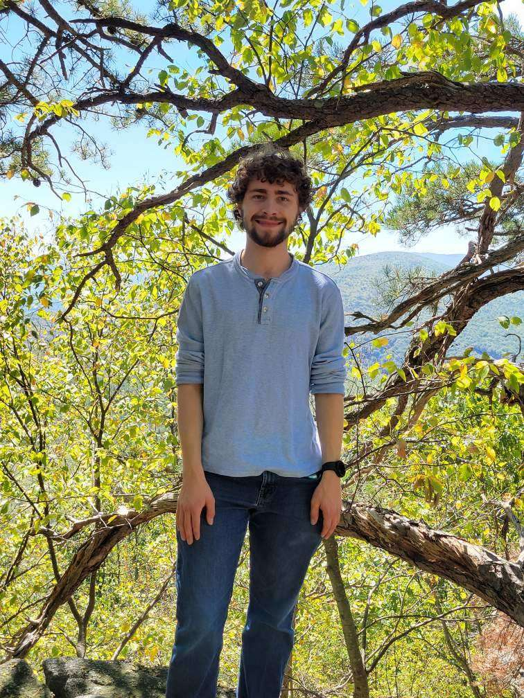
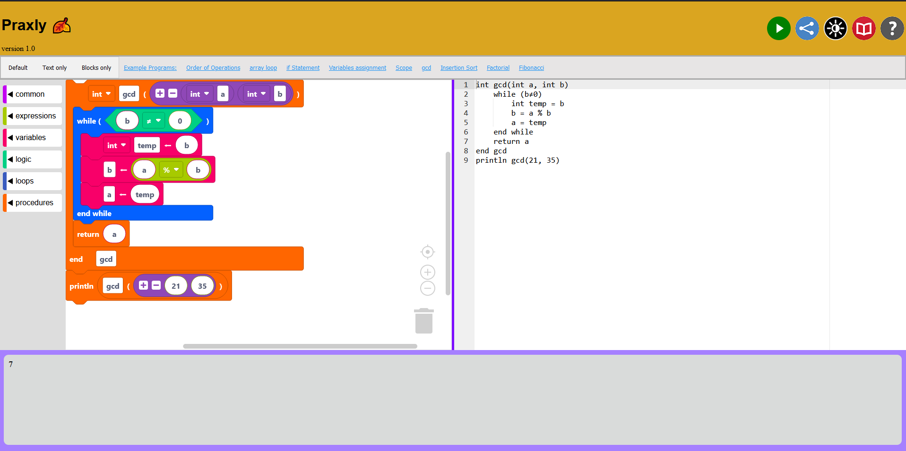

# About Me

## Introduction
{: style="width: 150px;"}

Hi, I'm Ben. I am a Software Developer from Winchester, VA. I am currently working full time at <a href="https://www.hrecc.org/">Harrisonburg Rockingham County Emergency Communications Center</a> and tutoring computer science at <a href="https://www.brcc.edu/">Blue Ridge Community college. </a> In college, my favorite topics that I learned about were in graph theory, compilers, and creating programming languages. My goal is to teach computer science.

## Education
I have Bachelor's of Science degree in Computer Science from James Madison University. I graduated with Honors and Distinction in May 2024. My minor was in Mathematics. I have been admitted to a master's degree program in computer science in November 2025. 

## Projects
### Praxly

[Praxly](https://praxly.cs.jmu.edu/) is an online IDE for the Virginia Praxis Exam pseudocode that supports both block-based and text-based programming. Working in collaboration with CodeVA, I built Praxly during my undergrad as part of my honor's thesis to support teachers that are learning programming for the Praxis exam. I presented research  to JMU peers and faculty 2023, 2024 and at a global conference SIGSCE 2025. We have a [publication](https://dl.acm.org/doi/pdf/10.1145/3641555.3705231) in the ACM digital library and 
fourthcoming submission to the JMU Student Reasearch Journal.  

 The screenshot is from the completion of the first stable version in April 2024. During the following summer, a new student, Ellona, became my successor and has made many improvments to Praxly.  
  
                    

## Current / Future Projects
### Unnamed Schedule Builder
I am planning on building some sort of software that I can use to build schedules for events. I am still in the brainstorming and designing phases, so I haven't started writing any code yet. The biggest challenge I have ran into so far is the state explosion of all the different variables that might effect how a schedule is built. I also do not have much time to work on personal projects as of now. 

### Course Material
I want to submit some course material that I make for the early Computer Science classes for those who are interested. More to come soon. 

## Experience
* HRECC - Software Portfolio Specailist
* American Woodmark Corporation - Software Developer
* JMU Department of Computer Science -  Lead TA
* JMU Research Assistant
* FedEx - Package Handler
* Berry Global - Packer	
* Cracker Barrel - server	

